<!-- omit in toc -->
# Projet 2 - Word Press (par Mohamed, Yana et Ziadoon)

- [Fonctionalités demandées](#fonctionalités-demandées)
  - [ADMINS (Super-utilisateurs)](#admins-super-utilisateurs)
    - [Onglets WordPress](#onglets-wordpress)
  - [Page d'accueil](#page-daccueil)
  - [Page About](#page-about)
  - [Page Galerie](#page-galerie)
  - [Page E-shop (albums / produits dérivés)](#page-e-shop-albums--produits-dérivés)
  - [Page Blog/News](#page-blognews)
    - [Une news](#une-news)
  - [Page Contact](#page-contact)
  - [Bonus](#bonus)
- [Découpe du template](#découpe-du-template)
  - [Header (navigation)](#header-navigation)
  - [Footer](#footer)
  - [Bannière - Best news](#bannière---best-news)
  - [Section "Mots du label"](#section-mots-du-label)
  - [Section "Prochains évenements"](#section-prochains-évenements)
  - [Section "Pourquoi nous ?"](#section-pourquoi-nous-)
  - [Section "Notre histoire"](#section-notre-histoire)
  - [Colonne Discographie](#colonne-discographie)
  - [Section "Galerie"](#section-galerie)
  - [Article (la vignette)](#article-la-vignette)
  - [Un item dans e-shop](#un-item-dans-e-shop)
- [Le travail de groupe](#le-travail-de-groupe)
  - [Disponibilités](#disponibilités)
  - [Deadlines](#deadlines)
  - [Trello](#trello)
  - [Recherches / à faire rapidement](#recherches--à-faire-rapidement)

Le client est un label de musique Liégeois portant le nom du **Wi m'fi Records**. Leur mission principale est de produire, d'éditer, de distribuer les artistes locaux. Ils mettent en lumière les albums (numériques, disques et vinyles), les news et les évenements, mais également un e-shop avec la possibilité d'obtenir les albums, ainsi que des produits dérivés.

On peut trouver les consignes détaillées [ici](https://github.com/sirius-school/Semaine-12/blob/master/exercices/wp-groupe-A.md).

## Fonctionalités demandées

### ADMINS (Super-utilisateurs)

* Gérer, supprimer et ajouter des [articles/news](#page-blognews) ;
* Gérer, supprimer et ajouter des items à vendre dans le [e-shop](#page-e-shop-albums--produits-dérivés) ;
* Gérer, supprimer et ajouter des évenements qui vont être affichés sur la [page d'accueil](#page-daccueil) ;
* Gérer, supprimer et ajouter des albums à la colonne (section) [**Discographie**](#colonne-discographie) (pages [*About*](#page-about) et [*Blog*](#page-blognews)).

#### Onglets WordPress

* Blog/articles/news ;
* Evenements ;
* Discographie ;
* E-shop - Musiques ;
* E-shop - Produits dérivés.

### Page d'accueil

* [Header](#header-navigation) ;
* [Bannière](#bannière---best-news) ;
* ["Mots du label"](#section-mots-du-label) ;
* ["Prochains évenements"](#section-prochains-évenements) (choisis par un [**Admin**](#admins-super-utilisateurs)) - [vignettes](#article-la-vignette), 4, avec slides pour plus ;
* ["Pourquoi nous ?"](#section-pourquoi-nous-), 3 ;
* [Footer](#footer).

### Page About

* [Header](#header-navigation) ;
* ["Notre histoire"](#section-notre-histoire) ;
* Section (colonne) [**Discographie**](#colonne-discographie) - créée avec le **plug-in ACF**, gerée par le [**Admin**](#admins-super-utilisateurs) ;
* [Footer](#footer).

### Page Galerie

* [Header](#header-navigation) ;
* ["Galerie"](#section-galerie) - Système de filtration ("Tout", "Concerts", "Groupes", "Stuff") + photos (4 par lignes) ;
* [Footer](#footer).

### Page E-shop (albums / produits dérivés)

* [Header](#header-navigation) ;
* Deux sections distinctes - **Acheter la Musique** et **Produits dérivés** avec 4 [items](#un-item-dans-e-shop) chacun ;
* [Footer](#footer).

:bulb: Le systeme d'e-shop - [**WooCommerce**](https://woocommerce.com/) avec le payement via bancontact/mastercard ou via virement bancaire (à voir selon les **plugins** mis à disposition).

### Page Blog/News

* [Header](#header-navigation) ;
* Les news/articles du label sous forme de [vignettes](#article-la-vignette) - 5, date, image, titre, extrait de l'article + **button** redirigeant vers l'article détaillé ;
* Section (colonne) [**Discographie**](#colonne-discographie) - créée avec le **plug-in ACF**, gerée par le [**Admin**](#admins-super-utilisateurs) ;
* [Footer](#footer).

#### Une news

* [Header](#header-navigation) ;
* L'article détaillé de la news (image + date + titre + texte) ;
* [Footer](#footer).

### Page Contact

* [Header](#header-navigation) ;
* Formulaire (inputs de nom, e-mail, website/objet/thème et texte) de contact - système de messagerie (avec un **plug-in au choix**) - pour artistes qui veulent contacter le label ;
* Google Map ;
* [Footer](#footer).

### Bonus

- [ ] Intégration des **vidéos** clips dans les articles ;
- [ ] Diffuser en bas les produits dérivés d'un album précis, lorsque nous sommes sur la page de cet album ;
- [ ] Rendre le design (style) plus **Punk** ;
- [ ] L'article détaillé d'un évenement ;
- [ ] Le système des filtres/tags pour les news et évenements ;
- [ ] Animation de bannière ;
- [ ] Newsletter via MailShimp - plug-in ;
- [ ] Le système de filtration pour les photos, sur la page [Galerie](#page-galerie).

## Découpe du template

### Header (navigation)

* Logo et slogan ;
* Lien [Accueil](#page-daccueil) ;
* Lien [Galerie](#page-galerie) ;
* Lien [Shop](#page-e-shop-albums--produits-dérivés) ;
* Lien [Blog](#page-blognews) ;
* Lien [Contact](#page-contact).

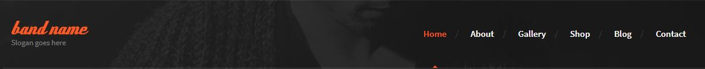

### Footer

* Logo ;
* Adresse ;
* Mail ;
* S'inscrire à la newsletter avec un input pour le mail et un button submit ;
* 4 pictos/liens vers les réseaux sociaux ;
* Copyright.

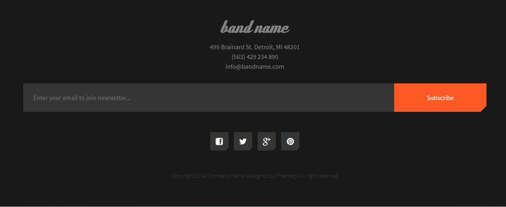

### Bannière - Best news

3 slides avec Titre, sous-titre (lieu, date ?), courte description, button "Lire plus".

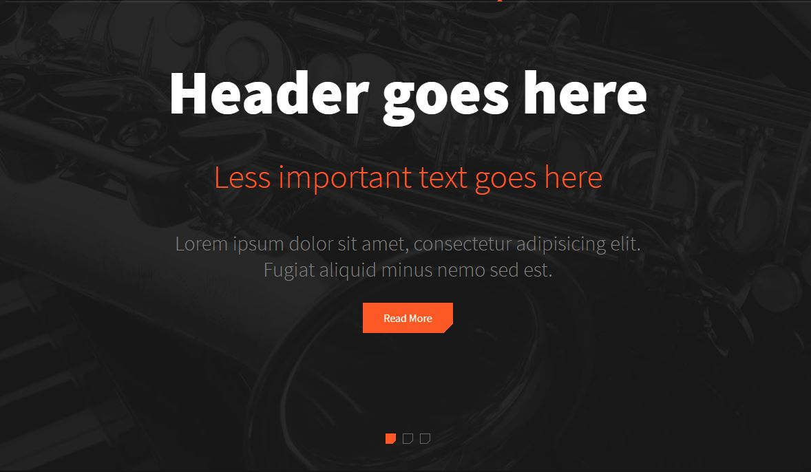

### Section "Mots du label"

2 slides avec Citation, author, sa fonction.

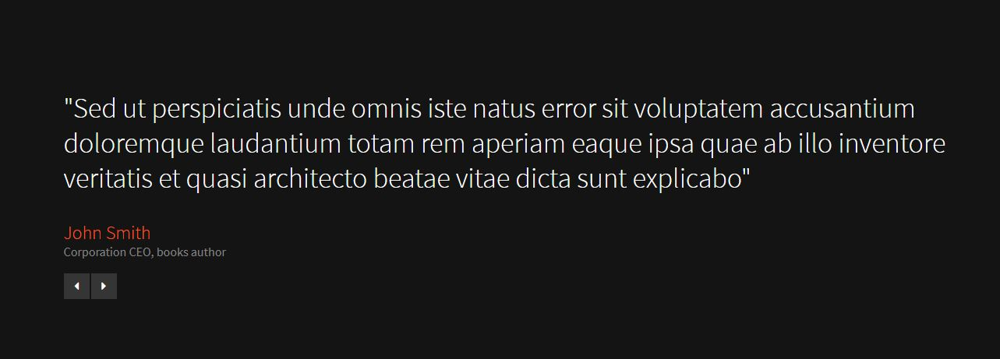

### Section "Prochains évenements"

4 évenements ([vigniettes](#article-la-vignette)) avec Date, titre et courte description.

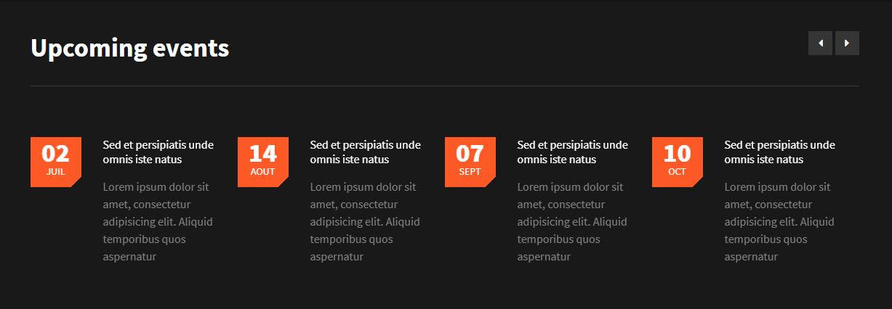

### Section "Pourquoi nous ?"

3 raisons avec Image, nom, courte description.

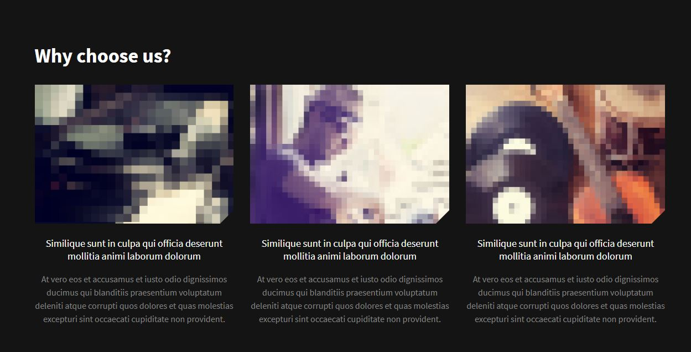

### Section "Notre histoire"

Titre, image, intro, texte.

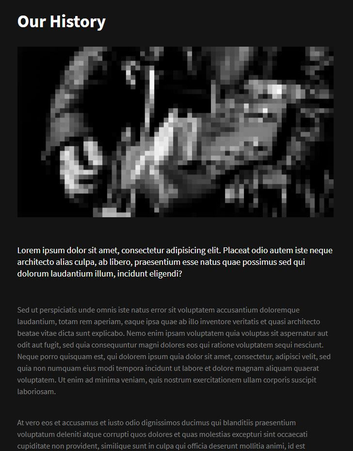

### Colonne Discographie

5 vignettes avec Image, titre, année, le nombre des morceaux.

### Section "Galerie"

* Système de filtration - "Tout", "Concerts", "Groupes", "Stuff" - bonus ;
* Les photos, 4 par lignes.

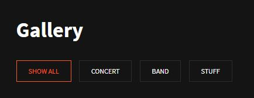
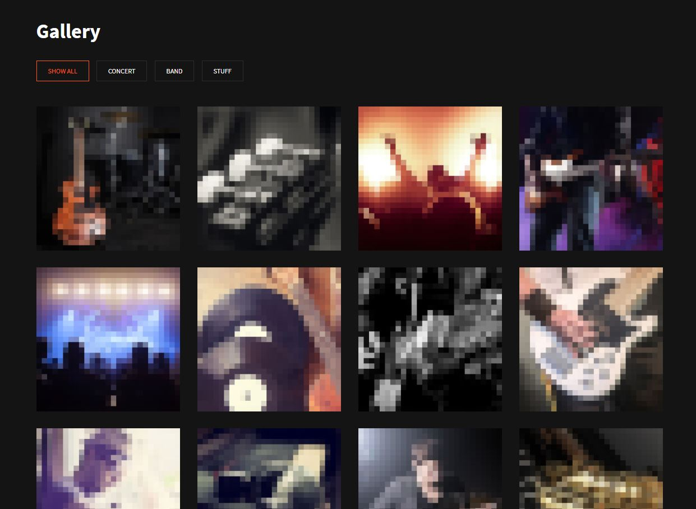

### Article (la vignette)

* Date ;
* Image ;
* Titre ;
* Extrait de l'article ;
* Button Lire plus.

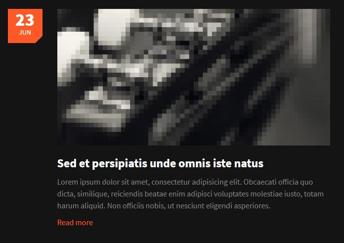

### Un item dans e-shop 

* Nom ;
* Année ;
* Button **Acheter** ;
* Button **Écouter** pour écouter l'album ou **Regarder** pour afficher une image du produit dérivé ;
* Section de Partage - 4 pictos/liens vers les réseaux sociaux, pour partager l'achat.

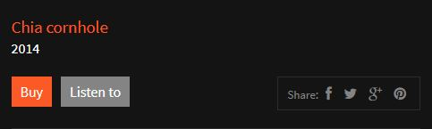

## Le travail de groupe

### Disponibilités

| Dates        | Mohamed    | Yana       | Ziadoon    |
| ------------ | ---------- | ---------- | ---------- |
| LU **14/9**  | v          | v          | v          |
| MA **15/9**  | v          | v          | v          |
| ME **16/9**  | v          | v          | v          |
| JE **17/9**  | v          | v          | x / v      |
| VE **18/9**  | v          | v          | v          |
| **WEEK-END** | **x**      | **x**      | **x**      |
| LU **21/9**  | v          | v          | v          |
| MA **22/9**  | v          | x / v      | v          |
| ME **23/9**  | v          | v / x      | v          |
| JE **24/9**  | v          | v          | v          |
| VE **25/9**  | **CEFORA** | **CEFORA** | **CEFORA** |
| **WEEK-END** | **x**      | **x**      | **x**      |
| LU **28/9**  | v          | v          | v          |
| MA **29/9**  | v          | v          | v          |
| ME **30/9**  | v          | v          | v          |
| JE **1/10**  | v          | v          | v          |
| VE **2/10**  | **CEFORA** | **CEFORA** | **CEFORA** |

Mohamed : part à 15h40, fini le travail dans le train. + 1h à la maison tous les jours. 

Yana : 22/9 - absente le matin, peut-être ; 23/9 - part à 15h. + peut travailler 3 soirées par semaine. 

Ziadoon : 1re semaine - absent une matiné. + 1h à la maison deux jours par semaine. L'application sur le projet va dépendre des cours. 

### Deadlines

:bulb: **Stand up meeting chaque matin**

**18/9** Lire le pdf, créer un fichier avec des questions, faire réunion commune penchant sur les questions ;

**30/9** Mise en commun du travail de chaque personne ;

**1/10** Correction, si nécessaire, le rendu du projet.

### Trello

[Voici le tableau](https://trello.com/b/Y83XnPX1/projet-2-wordpress) de Trello.

### Recherches / à faire rapidement

- [ ] Comment génerer une page détaillée d'un article/news ;
- [ ] MailShimp - newsletter ;
- [ ] Embed - Spotify, YouTube, Google Map (ou autre) ;
- [x] Faire table de matière - read me ;
- [x] Comment faire un lien direct dans le read me.
